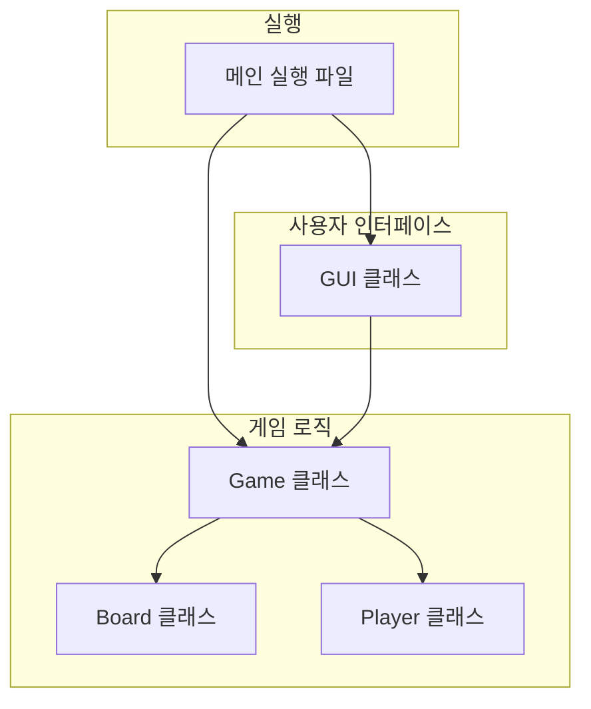

# 오목 게임 (Omok Game)

파이썬으로 만든 2인용 로컬 오목 게임입니다. GUI 환경에서 즐길 수 있는 클래식한 오목 게임으로, 파이썬 초급자도 이해할 수 있도록 설계되었습니다.

## 🎮 게임 특징

- **2인용 로컬 플레이어**: 같은 컴퓨터에서 번갈아가며 플레이
- **직관적인 GUI**: 마우스 클릭으로 쉽게 돌을 놓을 수 있음
- **실시간 승리 판정**: 5목이 완성되면 즉시 게임 종료
- **쌍삼 방지 기능**: 쌍삼(두 개의 열린 삼)이 되는 위치에는 돌을 놓을 수 없으며, 빨간색 반투명 표시로 경고
- **게임 상태 표시**: 현재 플레이어와 게임 진행 상황을 실시간으로 표시
- **플레이어 닉네임**: 게임 시작 전 플레이어 닉네임을 입력할 수 있음
- **재시작 기능**: 언제든지 새로운 게임을 시작할 수 있으며, 닉네임도 변경 가능

## 🛠️ 기술 스택

- **Python 3.9+**
- **tkinter**: GUI 프레임워크 (파이썬 기본 라이브러리)
- **Pillow**: 이미지 처리 (돌 이미지용)

## 📦 설치 방법

1. 저장소를 클론합니다:
```bash
git clone <repository-url>
cd omok
```

2. 필요한 패키지를 설치합니다:
```bash
pip install -r requirements.txt
```

3. 게임을 실행합니다:
```bash
python main_2d.py
```

## 🎯 게임 규칙

1. **게임판**: 15x15 크기의 바둑판
2. **돌**: 흑돌(검은색)과 백돌(흰색)을 번갈아가며 배치
3. **승리 조건**: 가로, 세로, 대각선 중 하나의 방향으로 5개의 돌을 연속으로 놓으면 승리
4. **쌍삼 금지**: 쌍삼(두 개의 열린 삼을 동시에 만드는 수)이 되는 위치에는 돌을 놓을 수 없음
5. **순서**: 흑돌이 먼저 시작

## 🏗️ 프로젝트 아키텍처



## 📁 파일 구조

```
omok/
├── main_2d.py           # 게임 실행 파일
├── game.py              # 게임 로직 관리
├── board.py             # 오목판 클래스
├── player.py            # 플레이어 클래스
├── tkinter_gui.py       # GUI 인터페이스
├── nickname_dialog.py   # 닉네임 입력 다이얼로그
├── assets/              # 이미지 파일들
│   ├── black_stone.png
│   ├── white_stone.png
│   └── board.png
├── requirements.txt     # 의존성 파일
└── README.md            # 프로젝트 설명서
```

## 🎮 사용법

1. 게임을 실행하면 플레이어 닉네임 입력 창이 나타납니다
2. 각 플레이어의 닉네임을 입력하거나 빈칸으로 두어 기본 닉네임을 사용합니다
3. 15x15 오목판이 나타나면 흑돌 플레이어부터 시작하여 번갈아가며 돌을 놓습니다
4. 마우스로 원하는 위치를 클릭하여 돌을 배치합니다
5. 쌍삼이 되는 위치에는 빨간색 반투명 표시가 나타나며 돌을 놓을 수 없습니다
6. 5목이 완성되면 승리 메시지가 표시됩니다
7. "새 게임" 버튼을 클릭하여 새로운 게임을 시작할 수 있으며, 닉네임도 변경할 수 있습니다

## 🔧 주요 클래스 설명

### Game 클래스
- 게임의 전체적인 상태를 관리
- 플레이어 턴 관리, 승리 판정, 게임 재시작 기능

### Board 클래스
- 15x15 오목판의 상태를 관리
- 돌 배치, 승리 조건 확인, 보드 초기화 기능

### Player 클래스
- 플레이어 정보 관리 (이름, 돌 색상)
- 플레이어 턴 관리

### TkinterGUI 클래스
- tkinter를 사용한 사용자 인터페이스
- 마우스 이벤트 처리, 게임 상태 표시
- 무르기 기능, 쌍삼 방지 기능

### NicknameDialog 클래스
- 플레이어 닉네임 입력을 위한 다이얼로그
- 모달 창으로 닉네임 입력 처리

## 🚀 학습 포인트

이 프로젝트를 통해 학습할 수 있는 내용:

1. **클래스 설계**: 객체지향 프로그래밍의 기본 개념
2. **GUI 프로그래밍**: tkinter를 사용한 사용자 인터페이스 구현
3. **이벤트 처리**: 마우스 클릭 이벤트 처리
4. **게임 로직**: 승리 조건 판정 알고리즘
5. **모듈화**: 코드를 여러 파일로 나누어 관리
6. **상태 관리**: 게임 상태의 변화를 추적하고 관리
7. **콜백 시스템**: 이벤트 기반 프로그래밍
8. **무르기 기능**: 게임 상태 되돌리기 구현
9. **쌍삼 방지**: 오목 규칙 구현
10. **사용자 경험**: 직관적인 UI/UX 설계

## 🤝 기여하기

버그 리포트나 기능 제안은 언제든지 환영합니다!

## 📄 라이선스

이 프로젝트는 MIT 라이선스 하에 배포됩니다. 